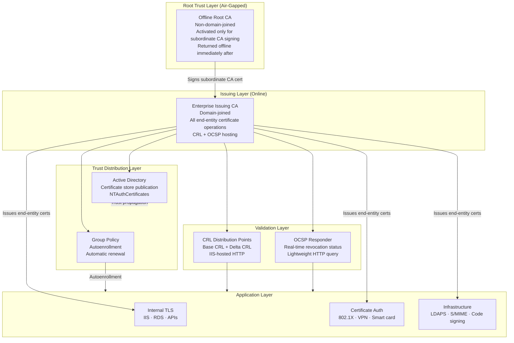

# Enterprise PKI Platform for Identity, Encryption and Trust (Microsoft ADCS)

> **Design Study** -- Independent architecture exercise for enterprise AD environments. Not associated with a production deployment.

Two-tier ADCS certificate authority architecture with offline Root CA, online Issuing CA, GPO-driven autoenrollment, and real-time OCSP revocation -- delivering internal PKI trust for Zero Trust and TLS encryption without third-party CAs.

---

## Architecture Diagram

---

## Executive Summary

Architected an enterprise PKI platform using Microsoft Active Directory Certificate Services (ADCS), establishing a secure identity and encryption foundation through a hardened two-tier certificate authority hierarchy.

The architecture introduces an offline Root CA as the protected trust anchor, a domain-integrated Enterprise Issuing CA for scalable certificate operations, automated certificate lifecycle management through GPO-based autoenrollment, centralised trust distribution via Active Directory, and real-time revocation validation through a dual CRL and OCSP model.

---

## Architecture Principles

- Protection of the root trust anchor through physical and logical isolation -- non-negotiable
- Separation of trust hierarchy responsibilities -- Root CA signs subordinate CAs only, never end-entity certificates
- Automated certificate lifecycle management eliminating manual enrollment and renewal overhead
- Identity-driven trust enforcement through Active Directory-integrated certificate services
- Real-time certificate validation through OCSP reducing revocation latency beyond CRL-only models
- Least-privilege administrative access across all CA management functions
- Template-driven certificate governance standardising key usage, validity, and issuance policies
- Scalable trust distribution leveraging existing AD and GPO infrastructure

---

## Architecture Layers

### 1. Root Trust Layer
Air-gapped, offline Root Certificate Authority:
- No network connectivity in operational state
- Non-domain-joined -- eliminates AD-level compromise exposure
- Activated exclusively for subordinate CA certificate signing -- returned offline immediately after
- Never used for direct end-entity certificate issuance
- Strict role-based access and documented operational procedures

Rationale: A compromised Root CA invalidates every certificate in the entire hierarchy and every trusting system. Maximum isolation is the only appropriate security posture.

### 2. Issuing Layer
Domain-integrated Enterprise Issuing CA -- all operational certificate activity:
- Domain-joined for AD integration, autoenrollment, and subject name resolution
- Certificate issuance and lifecycle management for all enterprise workloads
- Certificate template enforcement -- key usage, validity, subject name, enrollment permissions
- AD integration for subject name resolution and security group-based authorisation
- CRL and OCSP infrastructure hosting
- AIA and CDP extension configuration for all issued certificates

### 3. Trust Distribution Layer
Active Directory and Group Policy for consistent trust propagation:
- Root CA and Issuing CA published to AD certificate store and NTAuthCertificates
- Automatic trust propagation to all domain-joined Windows systems
- GPO autoenrollment -- Computer and User Configuration policies
- Automatic certificate issuance, renewal, and replacement without manual intervention
- Consistent trust deployment across the full domain estate

### 4. Validation Layer
Dual CRL and OCSP model for tiered revocation validation:

CRL Distribution Points:
- Base CRL on scheduled interval -- complete revocation status
- Delta CRL on shorter interval -- incremental updates
- IIS-hosted HTTP distribution points
- CDP URLs embedded in all issued certificates

OCSP Responder:
- Real-time per-certificate revocation status
- OCSP signing certificate issued by Issuing CA
- AIA URLs embedded in all issued certificates
- Preferred for high-frequency validation: web services, VPN, 802.1X

### 5. Application Layer
Certificate consumption across internal workloads:

Internal TLS:
- IIS web server certificates for internal HTTPS services
- Remote Desktop Services TLS certificates
- Internal API encrypted communication

Network Access and Authentication:
- 802.1X computer certificates for domain-joined workstation network access
- Certificate-based VPN client authentication
- Smart card and certificate-based user authentication

Infrastructure Services:
- LDAPS TLS for domain controller LDAP communication
- S/MIME email signing and encryption
- Code signing for internal applications and scripts

---

## Design Decisions

### ADR-001 -- Offline Root CA
**Decision:** Air-gapped, non-domain-joined offline Root CA
**Rationale:** An online Root CA -- even with network access controls -- remains exposed to network-based attack vectors. Offline eliminates this entirely. Operational cost is minimal: Root CA required only when signing Issuing CA certificates, which occurs infrequently (every 5-10 years for renewal).
**Trade-off:** Operational complexity for Issuing CA renewal requires documented procedures and physical access controls.

### ADR-002 -- Enterprise Issuing CA with AD Integration
**Decision:** Domain-joined Enterprise CA (not Standalone)
**Rationale:** AD integration enables automated certificate operations, centralised trust management, and scalable lifecycle governance. Standalone CA requires manual trust distribution and separate enrollment mechanisms.
**Trade-off:** Domain dependency -- Issuing CA compromise has broader impact than standalone deployment.

### ADR-003 -- OCSP over CRL-Only
**Decision:** OCSP Responder in addition to CRL distribution
**Rationale:** CRL-only requires clients to download and parse complete revocation lists -- poor latency and bandwidth overhead at scale. OCSP provides lightweight, per-certificate, real-time responses.
**Trade-off:** Additional infrastructure component. Mitigated by OCSP signing certificate automation.

### ADR-004 -- GPO-Based Autoenrollment
**Decision:** GPO autoenrollment for all domain-joined endpoints
**Rationale:** Manual enrollment at enterprise scale is unsustainable. GPO automates issuance and renewal -- ensuring consistent coverage and preventing service disruption from unmanaged expiry.
**Trade-off:** Limited to domain-joined Windows systems. Non-domain-joined, Linux, and network devices require SCEP, EST, or manual workflows.

### ADR-005 -- Internal PKI over External CAs
**Decision:** Internal PKI for all internal workload certificates
**Rationale:** External CAs for internal workloads introduce cost, third-party trust dependency, and reduced operational control. Internal PKI provides complete governance over issuance, revocation, and lifecycle.
**Trade-off:** Operational responsibility for PKI infrastructure management. Addressed through automation and documented procedures.

### ADR-006 -- HSM Integration Deferred
**Decision:** Software key storage for initial deployment (HSM in future roadmap)
**Rationale:** Offline Root CA model provides meaningful protection without HSM. HSM adds significant cost and complexity.
**Trade-off:** Lower cryptographic assurance than HSM-backed keys. For high-assurance environments (financial services, government), HSM should be a deployment requirement.

---

## Technologies

| Category | Technologies |
|---|---|
| PKI Infrastructure | Microsoft Active Directory Certificate Services (ADCS) |
| Certificate Authorities | Offline Root CA · Enterprise Issuing CA |
| Directory Services | Active Directory · Group Policy (GPO) |
| Web Services | Microsoft IIS |
| Validation Services | CRL Distribution Points · OCSP Responder |
| Automation | PowerShell · certutil · certreq |
| Compliance | NIST SP 800-57 · CIS Controls v8 · Zero Trust Architecture |

---

## Compliance Mapping

| Control | Framework | Implementation |
|---|---|---|
| Cryptographic key management | NIST SP 800-57 | Offline Root CA · template key length enforcement |
| PKI certificate policies | NIST SP 800-57 | Certificate templates · key usage constraints |
| Audit logging | CIS Control 8 | CA audit logging · certificate issuance events |
| Access control | CIS Control 6 | CA role separation · least-privilege admin |
| Certificate lifecycle | CIS Control 16 | GPO autoenrollment · automated renewal |
| Revocation management | NIST SP 800-57 | Dual CRL + OCSP infrastructure |
| Zero Trust identity | ZTA NIST SP 800-207 | Certificate-based auth · 802.1X · VPN |

---

## Repository Structure

enterprise-pki-adcs/
├── scripts/
│   ├── Install-RootCA.ps1
│   ├── Install-IssuingCA.ps1
│   ├── Configure-OCSPResponder.ps1
│   ├── New-CertificateTemplate.ps1
│   └── Get-CertificateExpiryReport.ps1
├── config/
│   ├── root-ca-policy.inf
│   ├── issuing-ca-policy.inf
│   └── certificate-templates.json
├── docs/
│   ├── architecture.md
│   ├── compliance-mapping.md
│   ├── operational-procedures.md
│   └── offline-root-ca-runbook.md
└── pipelines/
    └── pki-validation-pipeline.yml

---

## Future Evolution

- HSM integration for Root CA and Issuing CA private key protection
- Azure Key Vault integration for cloud-native certificate lifecycle automation
- Certificate expiry monitoring dashboard with estate-wide visibility
- Short-lived certificate models reducing reliance on revocation infrastructure
- PowerShell DSC automation for consistent, repeatable PKI deployment
- cert-manager integration for Kubernetes workload certificate automation
- Automated compliance reporting for certificate governance and lifecycle SLA tracking

---

*Part of the [sergeksfumey](https://github.com/sergeksfumey) infrastructure architecture portfolio · [sergeksfumey.com](https://sergeksfumey.com)*
